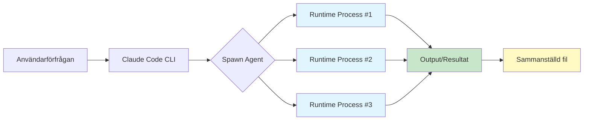
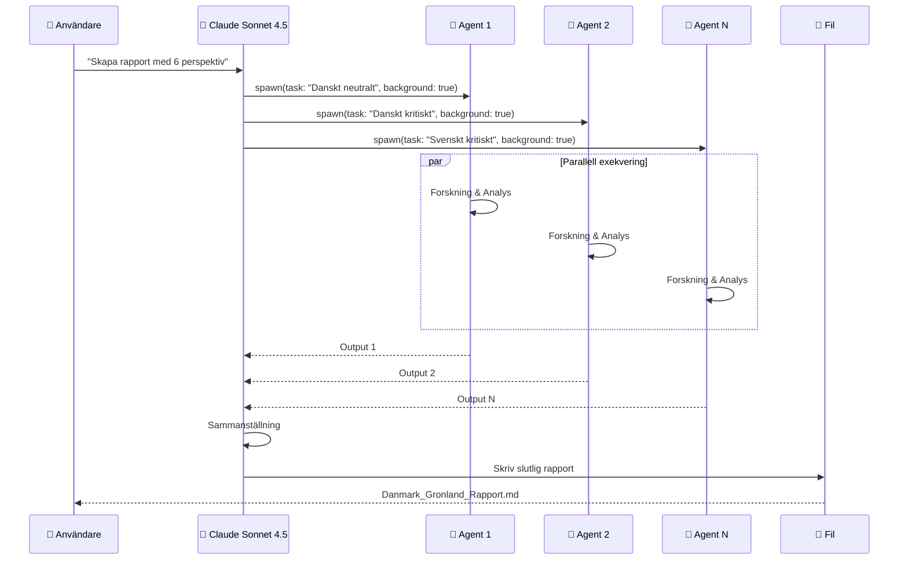

# ClaudeCode1 - AI-Agentbaserad Textproduktion

> **Ett demonstrationsprojekt som visar hur Claude Code kan användas för att skapa komplexa analyser med parallella AI-agenter**

## 📚 Projektöversikt

Detta projekt demonstrerar hur man använder **Claude Code** (Anthropics officiella CLI) tillsammans med **VS Code** för att skapa komplexa textdokument och analyser genom parallell exekvering av AI-agenter.

### 🎯 Huvudresultat

- **[Danmark-Grönland Rapport](https://kentlundgren.github.io/AI/ClaudeCode1/Danmark_Gronland_Rapport.md)** - En 25 000 ord omfattande flerperspektivanalys
- **[Perspektivdebatt](https://kentlundgren.github.io/AI/ClaudeCode1/debatt.html)** - Simulerad debatt mellan tre permanenta agenter
- **[Agentdokumentation](https://kentlundgren.github.io/AI/ClaudeCode1/ClaudeCodeAgenter1.html)** - Visuell dokumentation av agentarbetet
- **[Projektguide](https://kentlundgren.github.io/AI/ClaudeCode1/index.html)** - Interaktiv guide till projektet och agentanvändning
- **[CLAUDE.md](CLAUDE.md)** - Projektkoordinator med arbetsflöden och agentinstruktioner

### 🔗 Länkar

| Resurs | URL |
|--------|-----|
| **Live rapport (Markdown)** | [Danmark_Gronland_Rapport.md](https://kentlundgren.github.io/AI/ClaudeCode1/Danmark_Gronland_Rapport.md) |
| **Live debatt (HTML)** | [debatt.html](https://kentlundgren.github.io/AI/ClaudeCode1/debatt.html) |
| **Live dokumentation (HTML)** | [ClaudeCodeAgenter1.html](https://kentlundgren.github.io/AI/ClaudeCode1/ClaudeCodeAgenter1.html) |
| **Projektguide (HTML)** | [index.html](https://kentlundgren.github.io/AI/ClaudeCode1/index.html) |
| **GitHub Repository** | [kentlundgren/AI/ClaudeCode1](https://github.com/kentlundgren/AI/tree/main/ClaudeCode1) |

---

## 🤔 Varför ser jag inte agentfilerna?

### Den viktiga insikten

**Agenter är inte filer - de är tillfälliga runtime-processer!**

Detta är den vanligaste missuppfattningen när man börjar arbeta med Claude Code. Här är förklaringen:

### Vad är en agent egentligen?



#### Agenter är:
- ✅ **Runtime-processer** som körs i bakgrunden
- ✅ **Tillfälliga** - existerar bara under exekvering
- ✅ **Parallella** - kan köras samtidigt
- ✅ **Självständiga** - har egna verktyg och kontext

#### Agenter är INTE:
- ❌ Filer i ditt projekt
- ❌ Sparade skript eller program
- ❌ Permanenta entiteter
- ❌ Synliga i filsystemet efter körning

### Analogi: Webbserver och Requests

Tänk på agenter som HTTP-requests till en webbserver:

```
📱 Klient → 🌐 Server → 🔄 Request Process → 📄 Response
                             (tillfällig)        (sparad)

👤 Du → 🤖 Claude Code → 🤖 Agent Process → 📄 Output
                              (tillfällig)      (sparad)
```

När du besöker en webbsida:
- Servern skapar en **tillfällig process** för att hantera din request
- Processen gör sitt jobb och returnerar ett resultat
- Processen försvinner - du ser bara resultatet (HTML-sidan)

På samma sätt med agenter:
- Claude Code skapar **tillfälliga agentprocesser**
- Agenterna forskar, analyserar och producerar output
- Agenterna försvinner - du ser bara resultatet (rapporten)

### Var finns agenternas spår?

#### 1. Temporära körningsfiler

Under körning skapas temporära filer här:
```
C:\Users\[användare]\AppData\Local\Temp\claude\[projekt]\tasks\
```

Exempel från vårt projekt:
```
C:\Users\kentl\AppData\Local\Temp\claude\D--V-raFiler-prim-ra-p--SSD-Kent-dokument-Data-HTML-kentlundgren-se-program-AI-ClaudeCode1\tasks\
├── a2756ca.output    (Agent 1: Danskt neutralt)
├── ac1c786.output    (Agent 2: Danskt kritiskt)
├── a682e12.output    (Agent 3: Grönländskt neutralt)
├── a9a1d2d.output    (Agent 4: Grönländskt kritiskt)
├── a2ee4c9.output    (Agent 5: Svenskt neutralt)
└── ace2293.output    (Agent 6: Svenskt kritiskt)
```

**Men:** Dessa filer är tillfälliga och kan rensas när som helst.

#### 2. Agent-IDs

Varje agent får ett unikt ID vid körning:
- `a2756ca` - Agent 1 (Danskt neutralt perspektiv)
- `ac1c786` - Agent 2 (Danskt kritiskt perspektiv)
- `a682e12` - Agent 3 (Grönländskt neutralt perspektiv)
- `a9a1d2d` - Agent 4 (Grönländskt kritiskt perspektiv)
- `a2ee4c9` - Agent 5 (Svenskt neutralt perspektiv)
- `ace2293` - Agent 6 (Svenskt kritiskt perspektiv)

#### 3. Det permanenta resultatet

Det enda som är **permanent** och **sparat i projektet** är:
- ✅ `Danmark_Gronland_Rapport.md` - Slutrapporten
- ✅ `ClaudeCodeAgenter1.html` - Dokumentationen
- ✅ `README.md` - Denna fil

---

## 🏗️ Hur fungerar agentbaserad produktion?

### Grundkonceptet



### Steg-för-steg: Så skapades rapporten

#### Steg 1: Användarförfrågan
```
Användare: "Skapa lämpliga agenter för att analysera relationen
mellan Danmark och Grönland från danska, grönländska och svenska
perspektiv - både neutrala och kritiska."
```

#### Steg 2: Claude Code startar 6 agenter parallellt

```javascript
// Konceptuellt - så här fungerar det internt
Task({
  description: "Danskt neutralt perspektiv",
  prompt: "Researcha och analysera Danmark-Grönland från danskt neutralt perspektiv...",
  subagent_type: "general-purpose",
  run_in_background: true  // ← Kör i bakgrunden!
})
```

Alla 6 agenter startas **samtidigt** med:
- `run_in_background: true` - Kör parallellt
- Unika instruktioner för varje perspektiv
- Tillgång till WebSearch, WebFetch, Read/Write

#### Steg 3: Agenter forskar och analyserar

Varje agent:
1. Söker information på webben
2. Läser relevanta källor
3. Analyserar enligt sitt perspektiv
4. Skriver 2-3 sidor analys
5. Returnerar resultat till huvudagenten

**Detta sker parallellt** - alla 6 agenter arbetar samtidigt!

#### Steg 4: Huvudagenten sammanställer

Claude Sonnet 4.5 (huvudagenten):
1. Hämtar resultat från alla 6 agenter
2. Integrerar materialet
3. Skapar struktur (innehållsförteckning, inledning, avslutning)
4. Jämför perspektiv
5. Skriver slutlig rapport till fil

#### Steg 5: Resultat sparas permanent

```
ClaudeCode1/
├── Danmark_Gronland_Rapport.md  ✅ Permanent
├── ClaudeCodeAgenter1.html      ✅ Permanent
└── README.md                     ✅ Permanent

Temporära agentfiler (försvinner):
C:\Users\...\AppData\Local\Temp\claude\...\tasks\
├── a2756ca.output               ⏱️ Tillfällig
├── ac1c786.output               ⏱️ Tillfällig
└── ...                          ⏱️ Tillfällig
```

---

## 🛠️ Praktisk guide: Använd agenter i Claude Code

### Förutsättningar

1. **Installera Claude Code CLI**
   ```bash
   # Installationsinstruktioner från Anthropic
   npm install -g @anthropic-ai/claude-code
   ```

2. **Öppna projekt i VS Code**
   ```bash
   cd ditt-projekt
   code .
   ```

3. **Starta Claude Code i VS Code-terminalen**
   ```bash
   claude
   ```

### Exempel 1: Enkel agent

```markdown
👤 Du: Använd en agent för att researcha Python best practices

🤖 Claude Code använder då Task-verktyget:
Task({
  description: "Research Python best practices",
  prompt: "Search and summarize Python best practices for 2025",
  subagent_type: "general-purpose"
})

🤖 Agent körs → Resultat returneras → Claude sammanfattar för dig
```

### Exempel 2: Parallella agenter (som vårt projekt)

```markdown
👤 Du: Skapa 3 agenter som analyserar olika aspekter av AI-etik

🤖 Claude Code:
1. Startar Agent 1: "Tekniska aspekter" (parallellt)
2. Startar Agent 2: "Sociala aspekter" (parallellt)
3. Startar Agent 3: "Juridiska aspekter" (parallellt)
4. Väntar på alla 3
5. Sammanställer resultat
6. Skapar slutdokument
```

### Exempel 3: Sekvensiella agenter

```markdown
👤 Du: Researcha först om AI-verktyg, sedan skriv en guide

🤖 Claude Code:
1. Agent 1: "Research AI tools 2025" → Output
2. Vänta på Agent 1
3. Agent 2: "Write guide using research from Agent 1" → Output
4. Sammanställ
```

### Kodexempel: Så används Task-verktyget

```javascript
// Konceptuellt exempel - internt i Claude Code

// 1. Enkel agent (blockerar tills klar)
const result = await Task({
  description: "Analyze market trends",
  prompt: "Research and analyze current market trends in AI",
  subagent_type: "general-purpose"
});

// 2. Bakgrundsagent (blockerar inte)
const agentId = await Task({
  description: "Long research task",
  prompt: "Deep dive into quantum computing research",
  subagent_type: "general-purpose",
  run_in_background: true  // ← Returnerar omedelbart
});

// 3. Hämta resultat från bakgrundsagent
const output = await TaskOutput({
  task_id: agentId,
  block: true,  // Vänta tills klar
  timeout: 60000  // Max 60 sekunder
});

// 4. Parallella agenter
const agents = await Promise.all([
  Task({ description: "Task 1", prompt: "...", run_in_background: true }),
  Task({ description: "Task 2", prompt: "...", run_in_background: true }),
  Task({ description: "Task 3", prompt: "...", run_in_background: true })
]);

// Hämta alla resultat
const results = await Promise.all(
  agents.map(id => TaskOutput({ task_id: id, block: true }))
);
```

---

## 🆚 VS Code vs Cursor - Jämförelse

### Visual Studio Code (VS Code)

**Vad är det?**
- Microsofts gratis, open-source kodeditor
- Modulär arkitektur med extensions
- Används av 70%+ av alla utvecklare

**Claude Code i VS Code:**
```
VS Code (Editor)
    ↓
Terminal (integrerad)
    ↓
Claude Code CLI (körs i terminal)
    ↓
Chat-gränssnitt
    ↓
AI-agenter (spawn:as vid behov)
```

**Arbetsflöde:**
1. Öppna VS Code
2. Öppna integrerad terminal (`Ctrl + ö` eller `` Ctrl + ` ``)
3. Kör `claude` kommandot
4. Interagera med Claude via CLI-chat
5. Claude spawnar agenter automatiskt vid behov
6. Resultat visas i terminalen och skrivs till filer

**Fördelar:**
- ✅ Officiell Microsoft-produkt
- ✅ Enorm extension-ekosystem
- ✅ Gratis och open-source
- ✅ Claude Code är separat verktyg (modulärt)
- ✅ Fullständig kontroll över AI-interaktion

**Nackdelar:**
- ❌ Claude Code måste installeras separat
- ❌ Inte inbyggd AI - allt via CLI
- ❌ Mindre integrerad AI-upplevelse

### Cursor

**Vad är det?**
- Fork av VS Code med inbyggd AI
- Kommersiell produkt (prenumeration)
- Fokuserar på AI-first utveckling

**AI i Cursor:**
```
Cursor (Editor med inbyggd AI)
    ↓
AI-panel (inbyggd i UI)
    ↓
GPT-4 / Claude / annat
    ↓
Direktintegrering i editor
```

**Arbetsflöde:**
1. Öppna Cursor
2. AI-chat finns inbyggt i sidopanel
3. AI kan direkt redigera kod i editorn
4. Inline AI-suggestions medan du skriver
5. Cmd/Ctrl+K för AI-kommandon

**Fördelar:**
- ✅ Djupt integrerad AI i editorn
- ✅ Inline suggestions (Copilot-liknande)
- ✅ AI kan direkt redigera filer
- ✅ Chat-panel integrerad i UI
- ✅ Multi-file editing med AI

**Nackdelar:**
- ❌ Kommersiell produkt (kostar pengar)
- ❌ Mindre modulärt än VS Code + Claude Code
- ❌ Beroende av Cursors ekosystem

### Direktjämförelse

| Aspekt | VS Code + Claude Code | Cursor |
|--------|----------------------|--------|
| **Kostnad** | Gratis | $20/månad (ca) |
| **AI-integration** | CLI-baserad | Inbyggd i UI |
| **Flexibilitet** | Hög (modulärt) | Medium |
| **AI-modeller** | Claude (Anthropic) | GPT-4, Claude, m.fl. |
| **Agentsystem** | Ja (via Task-verktyg) | Begränsat |
| **Inline suggestions** | Nej (behöver Copilot) | Ja (inbyggt) |
| **Filredigering** | Via AI-kommandon | Direkt i editor |
| **Terminal-AI** | Ja (primär) | Ja (sekundär) |
| **Extension-stöd** | Fullt VS Code | Fullt VS Code (fork) |
| **Open source** | Ja (VS Code) | Nej (Cursor) |
| **Parallella agenter** | Ja (explicit) | Nej (implicit) |

### När använda vilket?

#### Välj VS Code + Claude Code om du:
- ✅ Vill ha gratis lösning
- ✅ Föredrar CLI-baserad AI-interaktion
- ✅ Behöver explicit agentkontroll (som i detta projekt)
- ✅ Vill ha open-source verktyg
- ✅ Önskar modulär arkitektur

#### Välj Cursor om du:
- ✅ Vill ha AI integrerad i editorn
- ✅ Föredrar visuell AI-interaktion
- ✅ Vill ha inline AI-suggestions
- ✅ Är bekväm med prenumerationskostnad
- ✅ Vill ha snabbare AI-arbetsflöde

### Kan man använda båda?

**Ja!** Många utvecklare använder:
- **Cursor** för daglig kodning (inline suggestions, snabb AI-hjälp)
- **VS Code + Claude Code** för komplexa uppgifter (agentbaserad produktion, omfattande analyser)

---

## 📊 Projektstruktur

```
ClaudeCode1/
├── README.md                          # Denna fil
├── ClaudeCodeAgenter1.html           # Visuell dokumentation av agentarbete
├── Danmark_Gronland_Rapport.md       # 25 000 ord flerperspektivanalys
│
└── [Temporära agentfiler - ej synliga]
    └── C:\Users\...\AppData\Local\Temp\claude\...\tasks\
        ├── a2756ca.output            # Agent 1: Danskt neutralt
        ├── ac1c786.output            # Agent 2: Danskt kritiskt
        ├── a682e12.output            # Agent 3: Grönländskt neutralt
        ├── a9a1d2d.output            # Agent 4: Grönländskt kritiskt
        ├── a2ee4c9.output            # Agent 5: Svenskt neutralt
        └── ace2293.output            # Agent 6: Svenskt kritiskt
```

---

## 🎓 Lärdomar från projektet

### 1. Agenter är runtime-processer
- **Lärdom:** Förstå att agenter inte är filer, utan tillfälliga processer
- **Praktisk implikation:** Spara viktig output omedelbart till filer

### 2. Parallell exekvering är kraftfull
- **Lärdom:** 6 parallella agenter arbetar lika snabbt som 1 agent
- **Praktisk implikation:** Använd `run_in_background: true` för effektivitet

### 3. Strukturera uppgifter tydligt
- **Lärdom:** Tydliga instruktioner till varje agent ger bättre resultat
- **Praktisk implikation:** Definiera exakt vad varje agent ska göra

### 4. Sammanställning är kritisk
- **Lärdom:** Rådata från agenter behöver struktureras och integreras
- **Praktisk implikation:** Planera för sammanställningsfas

### 5. Dokumentera processen
- **Lärdom:** Eftersom agenter försvinner, dokumentera hur de användes
- **Praktisk implikation:** Skapa dokumentation (som ClaudeCodeAgenter1.html)

---

## 🚀 Kom igång själv

### Steg 1: Installation

```bash
# Installera Claude Code CLI
npm install -g @anthropic-ai/claude-code

# Verifiera installation
claude --version
```

### Steg 2: Starta projekt

```bash
# Skapa projektmapp
mkdir mitt-agent-projekt
cd mitt-agent-projekt

# Öppna i VS Code
code .

# Starta Claude Code i VS Code-terminal
claude
```

### Steg 3: Testa enkel agent

```markdown
👤 I Claude Code chat:
"Använd en agent för att researcha de 5 bästa AI-verktygen 2025"

🤖 Claude spawnar agent automatiskt
🤖 Agent söker och analyserar
🤖 Resultat returneras
```

### Steg 4: Testa parallella agenter

```markdown
👤 I Claude Code chat:
"Skapa 3 agenter som analyserar AI-verktyg från:
1. Tekniskt perspektiv
2. Användarperspektiv
3. Kostnadsperspektiv

Sammanställ sedan till en rapport."

🤖 Claude spawnar 3 parallella agenter
🤖 Alla 3 arbetar samtidigt
🤖 Resultat sammanställs
🤖 Rapport skapas
```

### Steg 5: Experimentera!

- Testa olika antal agenter
- Prova olika perspektiv
- Kombinera sekvensiella och parallella agenter
- Dokumentera dina experiment

---

## 📖 Tekniska detaljer

### AI-modell
- **Modell:** Claude Sonnet 4.5
- **Model ID:** `claude-sonnet-4-5-20250929`
- **Provider:** Anthropic
- **Kunskapsbas:** Uppdaterad till januari 2025

### Agenttyper i Claude Code

#### 1. `general-purpose`
- Använd för: Forskning, analys, bred problemlösning
- Verktyg: WebSearch, WebFetch, Read, Write, Edit, Grep, Glob, Bash
- Används i detta projekt: ✅

#### 2. `Explore`
- Använd för: Utforska kodbaser, hitta filer, förstå struktur
- Snabb och fokuserad på kodsökning

#### 3. `Plan`
- Använd för: Planera implementationsstrategier
- Arkitektonisk design

### Task-verktyget: Parametrar

```javascript
Task({
  description: string,           // Kort beskrivning (3-5 ord)
  prompt: string,                 // Detaljerade instruktioner
  subagent_type: string,          // "general-purpose", "Explore", etc.
  run_in_background?: boolean,    // true = parallell, false = blockerar
  model?: string,                 // "sonnet", "opus", "haiku"
  resume?: string                 // Agent ID att återuppta
})
```

### TaskOutput-verktyget

```javascript
TaskOutput({
  task_id: string,       // Agent ID från Task
  block?: boolean,       // true = vänta, false = returnera omedelbart
  timeout?: number       // Max väntetid i millisekunder
})
```

---

## 🎯 Permanenta Claude Code-Agenter

### Vad är permanenta agenter?

Förutom tillfälliga runtime-agenter kan du skapa **permanenta agenter** som definieras i `.claude/agents/` mappen. Dessa agenter:
- ✅ Är filer som versionshanteras i ditt projekt
- ✅ Har YAML frontmatter med konfiguration
- ✅ Kan användas direkt av Claude Code
- ✅ Har specifika verktyg och modellval
- ✅ Innehåller detaljerade system prompts

### Permanenta agenter i detta projekt

Detta projekt använder tre specialiserade perspektivagenter:

#### 🇩🇰 danish-perspective
```yaml
---
name: danish-perspective
description: Danish perspective analyst for Denmark-Greenland relations
tools: Read, Grep, Glob, Bash, WebSearch, WebFetch
model: sonnet
permissionMode: default
---
```
**Kompetenser:** Rigsfællesskabet, bloktilskud, dansk säkerhetspolitik, historisk kontext

#### 🟢⚪🔴 greenlandic-perspective
```yaml
---
name: greenlandic-perspective
description: Greenlandic perspective analyst focusing on self-determination
tools: Read, Grep, Glob, Bash, WebSearch, WebFetch
model: sonnet
permissionMode: default
---
```
**Kompetenser:** Inuit kultur, dekolonisering, Kalaallisut-revitalisering, självbestämmande

#### 🇸🇪 swedish-perspective
```yaml
---
name: swedish-perspective
description: Swedish perspective with Sápmi parallels and Nordic critique
tools: Read, Grep, Glob, Bash, WebSearch, WebFetch
model: sonnet
permissionMode: default
---
```
**Kompetenser:** Nordiskt samarbete, Sápmi-jämförelser, kritisk självreflektion, arktisk geopolitik

### Hur permanenta agenter används

**Automatisk delegering:**
```
"Analysera bloktilskud från olika perspektiv"
→ Claude Code aktiverar relevanta perspektivagenter automatiskt
```

**Explicit användning:**
```
"Använd danish-perspective för att förklara Rigsfællesskabet"
```

**Multiperspektivanalys:**
```
"Låt alla tre perspektiv analysera Grönlands självständighet"
```

### CLAUDE.md - Projektkoordinator

`CLAUDE.md` är en speciell fil som Claude Code automatiskt laddar vid konversationsstart. I detta projekt innehåller den:
- 📋 Översikt över de tre perspektivagenterna
- 🔧 Arbetsflöden för att skapa debatter
- 📝 Kodstiluide och konventioner
- 🔗 Navigation footer templates
- 💡 Vanliga uppgifter och kommandon

Se [CLAUDE.md](CLAUDE.md) för fullständig dokumentation.

### Projektstruktur med permanenta agenter

```
ClaudeCode1/
├── .claude/
│   └── agents/              # Permanenta perspektivagenter
│       ├── danish-perspective.md
│       ├── greenlandic-perspective.md
│       └── swedish-perspective.md
├── CLAUDE.md               # Projektkoordinator
├── index.html              # Interaktiv guide
├── debatt.html             # Genererad debatt från agenter
├── Danmark_Gronland_Rapport.md
├── ClaudeCodeAgenter1.html
└── README.md
```

---

## 🔬 Avancerade tekniker

### 1. Resumable Agents

Agenter kan återupptas med tidigare kontext:

```javascript
// Första körningen
const agentId = Task({
  description: "Long research",
  prompt: "Research AI trends...",
  run_in_background: true
});

// Senare - återuppta samma agent
const continuedId = Task({
  description: "Continue research",
  prompt: "Based on previous research, analyze implications...",
  resume: agentId,  // ← Återuppta med kontext
  run_in_background: true
});
```

### 2. Agent-kedjar (Pipelines)

```javascript
// Agent 1 → Agent 2 → Agent 3
const research = await Task({
  description: "Research phase",
  prompt: "Research topic X..."
});

const analysis = await Task({
  description: "Analysis phase",
  prompt: `Analyze this research: ${research}...`
});

const report = await Task({
  description: "Report phase",
  prompt: `Create report from: ${analysis}...`
});
```

### 3. Dynamiska agentantal

```javascript
// Skapa N agenter baserat på input
const topics = ["AI", "Blockchain", "Quantum"];

const agents = await Promise.all(
  topics.map(topic => Task({
    description: `Research ${topic}`,
    prompt: `Deep dive into ${topic}...`,
    run_in_background: true
  }))
);

const results = await Promise.all(
  agents.map(id => TaskOutput({ task_id: id }))
);
```

---

## ❓ FAQ

### F: Varför syns inte agenterna som filer?
**S:** Agenter är runtime-processer, inte filer. De existerar bara under körning och försvinner sedan. Endast deras output (resultat) sparas permanent.

### F: Kan jag se agenter medan de körs?
**S:** Du kan se att agenter körs via system-meddelanden i Claude Code, och temporära output-filer finns i `AppData\Local\Temp\claude\...` under körning.

### F: Hur många agenter kan jag köra parallellt?
**S:** Det beror på ditt system och API-begränsningar. I detta projekt kördes 6 parallellt utan problem. Fler är möjligt.

### F: Kostar parallella agenter mer?
**S:** Nej, parallella agenter kostar lika mycket som sekventiella - du betalar för tokens, inte för antal agenter eller tid.

### F: Kan jag använda detta i Cursor?
**S:** Claude Code är specifikt för VS Code CLI. Cursor har sitt eget AI-system. Men du kan köra Claude Code CLI i Cursors terminal.

### F: Behöver jag betala för Claude Code?
**S:** Du behöver en Anthropic API-nyckel med kredit. Claude Code CLI är gratis, men API-användning kostar.

### F: Kan agenter kommunicera med varandra?
**S:** Inte direkt. Men huvudagenten (Claude) kan samordna dem genom att skicka output från en agent till en annan.

---

## 🎯 Nästa steg

### För nybörjare
1. ✅ Läs denna README
2. ✅ Installera Claude Code
3. ✅ Testa enkel agent
4. ✅ Testa 2-3 parallella agenter
5. ✅ Bygg eget projekt

### För avancerade
1. ✅ Experimentera med resumable agents
2. ✅ Bygg agent-pipelines
3. ✅ Kombinera olika agenttyper
4. ✅ Skapa egna agent-frameworks
5. ✅ Bidra till Claude Code community

---

## 📚 Resurser

### Officiella länkar
- [Claude Code GitHub](https://github.com/anthropics/claude-code)
- [Anthropic Documentation](https://docs.anthropic.com/)
- [VS Code Download](https://code.visualstudio.com/)

### Community
- [Claude Community Forum](https://community.anthropic.com/)
- [Discord Server](https://discord.gg/anthropic)

### Detta projekt
- [Live Rapport (Markdown)](https://kentlundgren.github.io/AI/ClaudeCode1/Danmark_Gronland_Rapport.md)
- [Live Debatt (HTML)](https://kentlundgren.github.io/AI/ClaudeCode1/debatt.html)
- [Live Dokumentation (HTML)](https://kentlundgren.github.io/AI/ClaudeCode1/ClaudeCodeAgenter1.html)
- [Projektguide (HTML)](https://kentlundgren.github.io/AI/ClaudeCode1/index.html)
- [GitHub Repository](https://github.com/kentlundgren/AI/tree/main/ClaudeCode1)

---

## 🔗 Projektnavigation

### 📄 Dokumentation
- [📄 Analysrapport](Danmark_Gronland_Rapport.md) - 25,000-ords flerperspektivanalys
- [🤖 Agentdokumentation](ClaudeCodeAgenter1.html) - Teknisk dokumentation
- [📋 CLAUDE.md](CLAUDE.md) - Projektkoordinator och arbetsflöden

### 💬 Interaktivt
- [📘 Projektöversikt](index.html) - Interaktiv guide till projektet
- [💬 Perspektivdebatt](debatt.html) - Simulerad debatt mellan agenter

### 🤖 Permanenta Agenter
- [🇩🇰 danish-perspective](.claude/agents/danish-perspective.md)
- [🟢⚪🔴 greenlandic-perspective](.claude/agents/greenlandic-perspective.md)
- [🇸🇪 swedish-perspective](.claude/agents/swedish-perspective.md)

### 🌐 Externa Länkar
- [💻 GitHub Repository](https://github.com/kentlundgren/AI/tree/main/ClaudeCode1)
- [📚 Claude Code Documentation](https://code.claude.com/docs)

---

## 👤 Författare

**Kent Lundgren**
- GitHub: [@kentlundgren](https://github.com/kentlundgren)
- Projekt: [kentlundgren/AI](https://github.com/kentlundgren/AI)

---

## 📄 Licens

Detta projekt är skapat för utbildnings- och demonstrationssyfte.

---

## 🙏 Acknowledgments

- **Anthropic** för Claude Code och Claude Sonnet 4.5
- **Microsoft** för Visual Studio Code
- **Open Source Community** för verktyg och inspiration

---

**Skapat:** 25 januari 2026
**AI-modell:** Claude Sonnet 4.5 (claude-sonnet-4-5-20250929)
**Verktyg:** Claude Code CLI i VS Code
**Permanenta agenter:** danish-perspective, greenlandic-perspective, swedish-perspective

---

*Skapad med Claude Code och permanenta perspektivagenter*

*"Agenter är inte filer - de är temporära arbetare som kommer, gör sitt jobb, och går. Men deras arbete lever kvar."*
